## When to Use

Use this skill when you want to:
- Create flowcharts and process diagrams
- Generate sequence diagrams
- Draw class diagrams or ER diagrams
- Create mind maps and organizational charts
- Visualize data with charts

**Triggers:**
- User says "draw a flowchart", "create diagram", "画流程图", "生成图表"
- User mentions "flowchart", "sequence diagram", "流程图", "时序图"
- User asks to "visualize process", "可视化流程"
- User provides a process description to visualize

## Quick Start

### Create a Flowchart
```
画一个用户登录的流程图
```

### Create a Sequence Diagram
```
生成一个用户下单的时序图
```

### Create a Mind Map
```
创建一个关于机器学习的思维导图
```

## Supported Diagram Types

### 1. Flowchart (流程图)
**Use for**: Process flows, decision trees, workflows

**Example**:
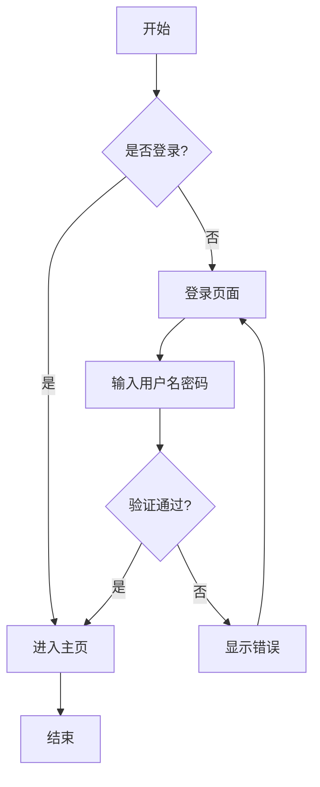

**Triggers**: "流程图", "flowchart", "process diagram"

---

### 2. Sequence Diagram (时序图)
**Use for**: API interactions, message flows, system communications

**Example**:
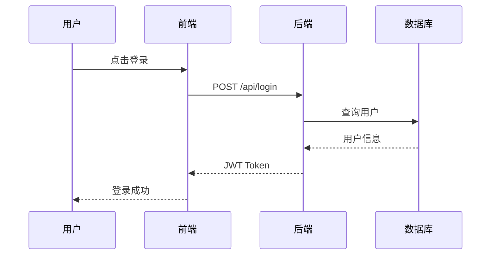

**Triggers**: "时序图", "sequence diagram", "交互图"

---

### 3. Class Diagram (类图)
**Use for**: Object-oriented design, database schemas

**Example**:
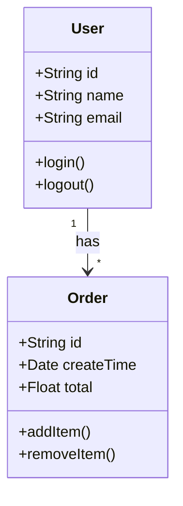

**Triggers**: "类图", "class diagram", "ER图"

---

### 4. Gantt Chart (甘特图)
**Use for**: Project timelines, task scheduling

**Example**:
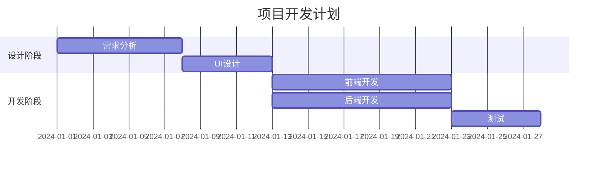

**Triggers**: "甘特图", "gantt chart", "时间线"

---

### 5. Mind Map (思维导图)
**Use for**: Brainstorming, knowledge organization

**Example**:
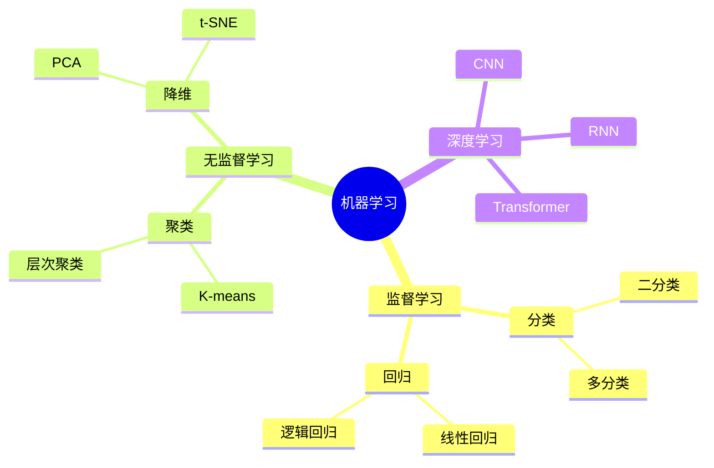

**Triggers**: "思维导图", "mind map", "脑图"

---

### 6. Pie Chart (饼图)
**Use for**: Data distribution, percentages

**Example**:
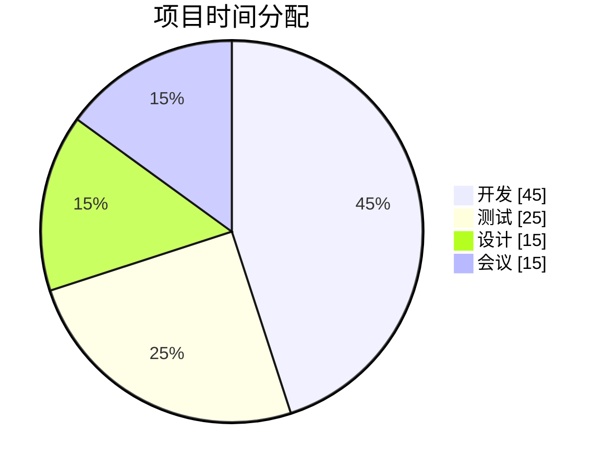

**Triggers**: "饼图", "pie chart", "占比图"

---

### 7. State Diagram (状态图)
**Use for**: State machines, object lifecycles

**Example**:
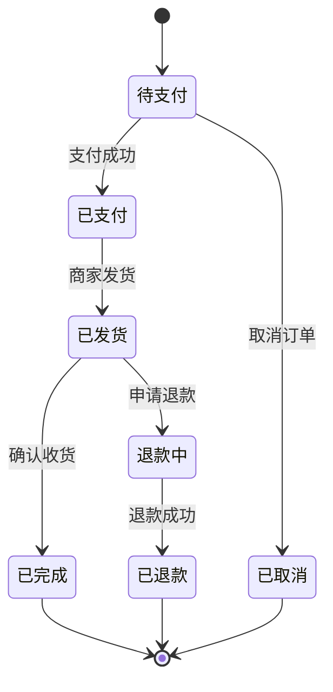

**Triggers**: "状态图", "state diagram"

---

### 8. ER Diagram (实体关系图)
**Use for**: Database design, data modeling

**Example**:
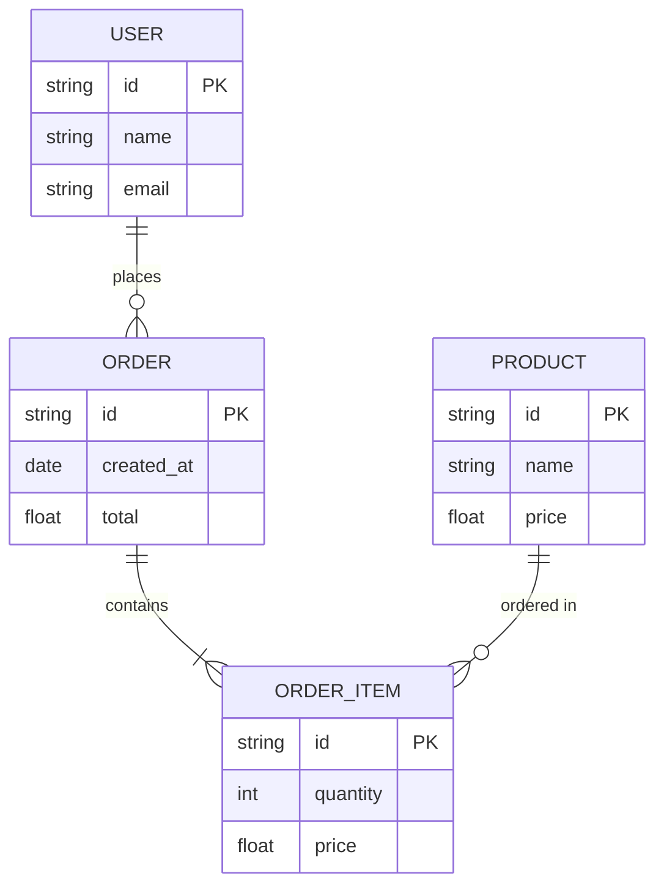

**Triggers**: "ER图", "实体关系图", "database diagram"

---

## Output Formats

### 1. Mermaid (Default)
- **Pros**: Widely supported, GitHub/GitLab native rendering
- **Cons**: Limited styling options

### 2. PlantUML
- **Pros**: More diagram types, powerful
- **Cons**: Requires server to render

### 3. Graphviz DOT
- **Pros**: Highly customizable
- **Cons**: Complex syntax

### 4. ASCII Art
- **Pros**: Works everywhere
- **Cons**: Limited visual appeal

## Usage Examples

### Example 1: User Authentication Flow
```
用户: 画一个用户认证的流程图，包括登录、注册、找回密码
```

**Generated**:
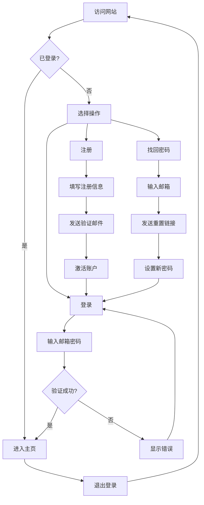

---

### Example 2: API Request Flow
```
用户: 生成一个微服务架构中用户下单的时序图
```

**Generated**:
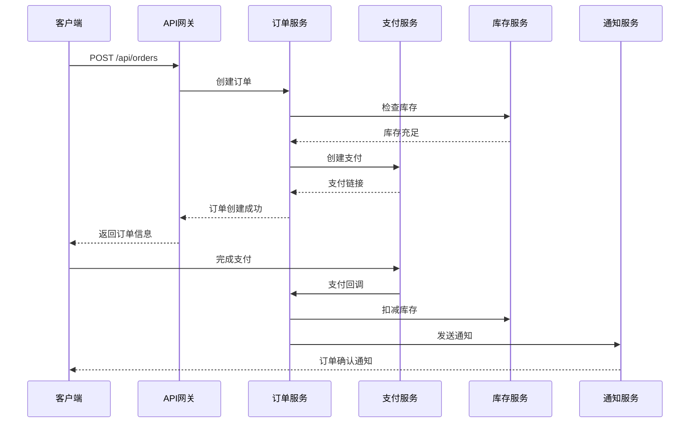

---

### Example 3: System Architecture
```
用户: 画一个电商系统的架构图
```

**Generated**:
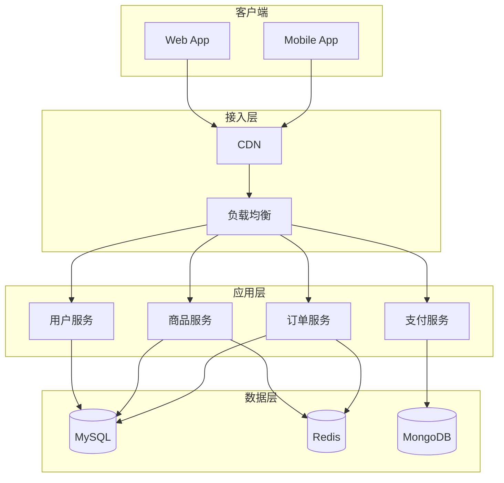

---

## Tools Integration

### View Diagrams

1. **Online Viewers**:
   - Mermaid Live Editor: https://mermaid.live/
   - PlantUML Online: https://www.plantuml.com/plantuml
   
2. **VS Code Extension**:
   - Install "Markdown Preview Mermaid Support"
   
3. **Obsidian**:
   - Native Mermaid support
   
4. **GitHub/GitLab**:
   - Native rendering in Markdown files

### Export Options

```bash
# Export to PNG
mmdc -i diagram.mmd -o diagram.png

# Export to SVG
mmdc -i diagram.mmd -o diagram.svg

# Export to PDF
mmdc -i diagram.mmd -o diagram.pdf
```

## Advanced Features

### Custom Styling
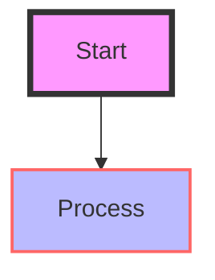

### Subgraphs
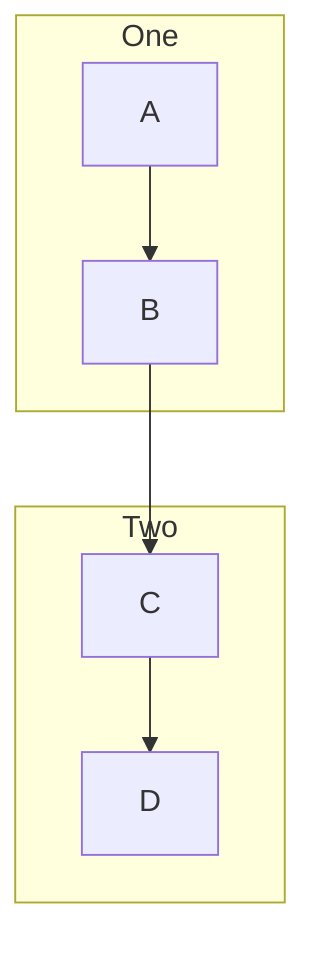

### Click Events


## Troubleshooting

### Diagram Not Rendering
**Problem**: Mermaid code shows as plain text
**Solution**: 
- Check syntax is correct
- Use Mermaid Live Editor to validate
- Ensure viewer supports Mermaid

### Complex Diagrams
**Problem**: Diagram too complex
**Solution**:
- Break into multiple diagrams
- Use subgraphs
- Simplify the flow

## Best Practices

1. **Keep it Simple**: One concept per diagram
2. **Use Clear Labels**: Avoid abbreviations
3. **Consistent Direction**: Top-down or left-right
4. **Color Coding**: Use colors to group related items
5. **Validate**: Test in Mermaid Live Editor first

## Related Skills

- `code-documenter` - Document code with diagrams
- `architecture-designer` - Design system architectures
- `data-visualizer` - Visualize data with charts

## Future Enhancements

- [ ] Auto-generate from code
- [ ] Interactive diagrams
- [ ] Animated flows
- [ ] Diagram templates library
- [ ] Multi-language labels
