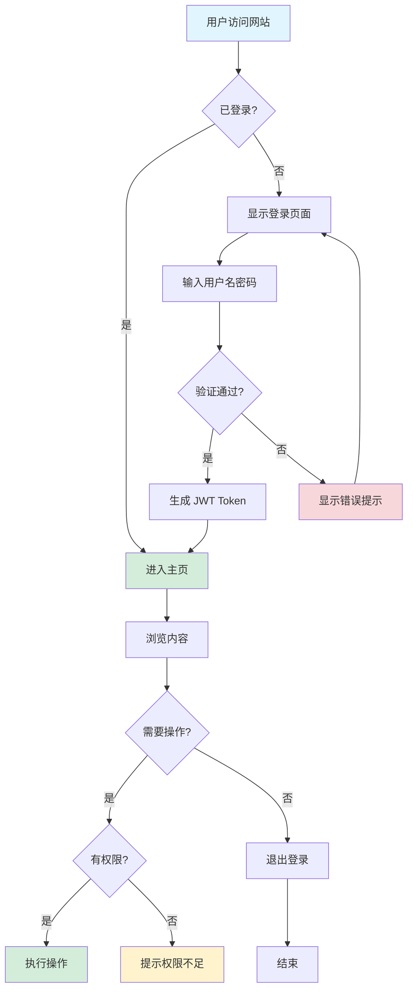
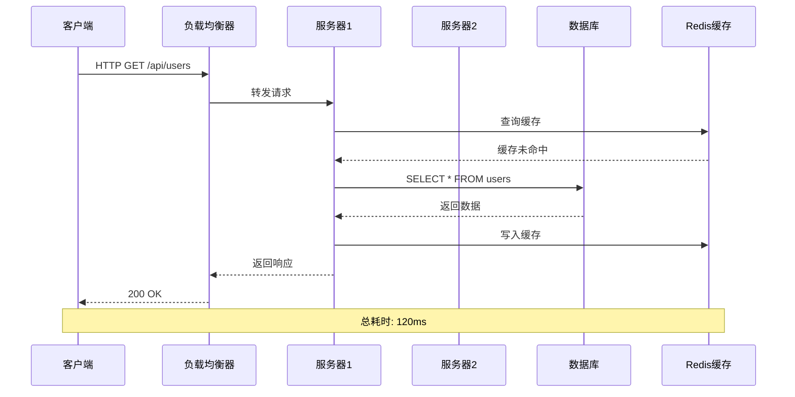
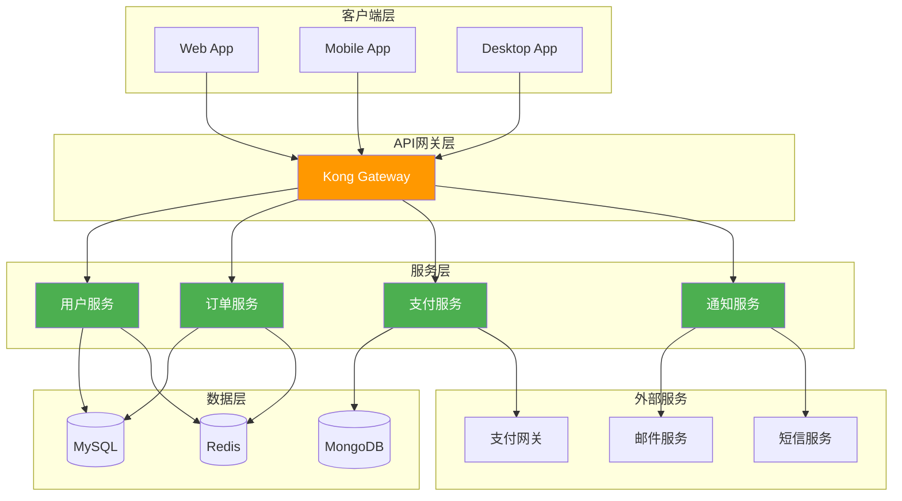
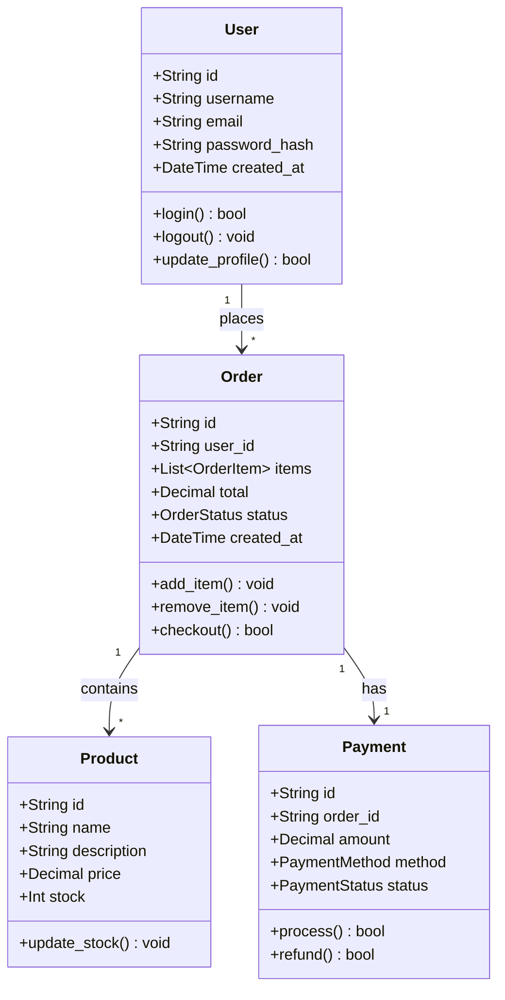
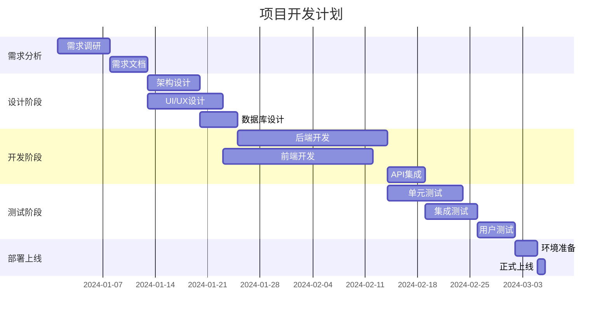
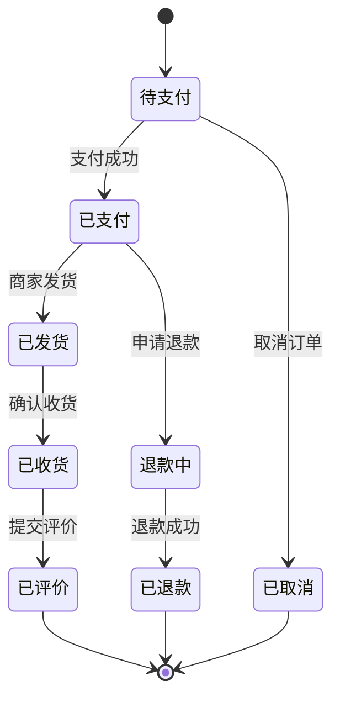
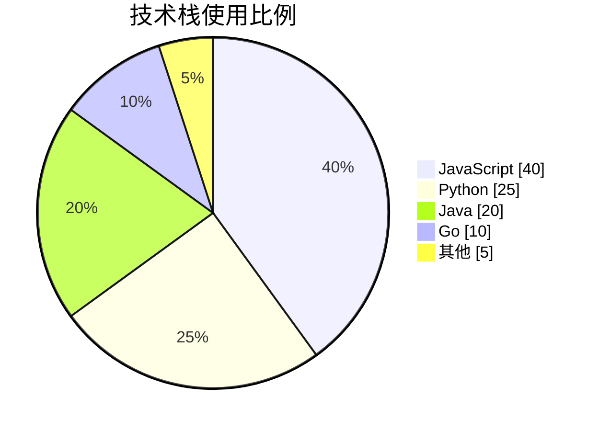
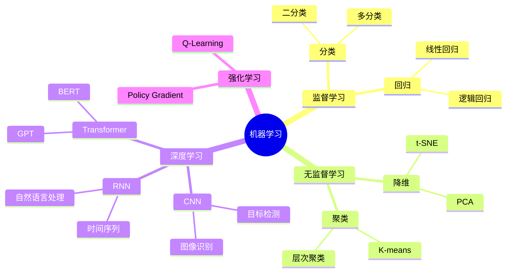

# 📊 Diagram Generator 示例

## 示例 1: 用户登录流程图



---

## 示例 2: API 请求时序图



---

## 示例 3: 系统架构图



---

## 示例 4: 类图



---

## 示例 5: 甘特图



---

## 示例 6: 状态图



---

## 示例 7: 饼图



---

## 示例 8: 思维导图



---

## 如何使用这些示例

1. **复制 Mermaid 代码**
2. **粘贴到支持 Mermaid 的编辑器**:
   - Mermaid Live Editor: https://mermaid.live/
   - VS Code (安装 Mermaid 插件)
   - Obsidian (原生支持)
   - GitHub/GitLab Markdown
3. **修改内容和样式**
4. **导出为 PNG/SVG/PDF**

---

## 快速生成流程图

告诉 Echo 你想要什么样的流程图：

```
画一个用户注册的流程图
生成一个微服务架构的系统图
创建一个订单处理的时序图
画一个数据库 ER 图
```

Echo 会自动生成 Mermaid 代码！
