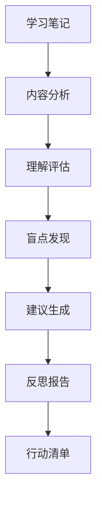

# Learning Reflector 🧠

> 深度反思学习过程，发现知识盲点，优化学习策略

[]()
[]()

## 📖 简介

Learning Reflector 通过 AI 分析你的学习笔记，提供：
- 🎯 **深度反思** - 评估理解深度，发现薄弱环节
- 🔍 **盲点发现** - 识别知识盲区和未探索领域
- 💡 **学习建议** - 个性化的学习路径优化
- 📈 **进度追踪** - 长期学习效果评估

## 🎯 使用场景

- 每日学习后的反思总结
- 发现知识盲点和薄弱环节
- 获得个性化学习建议
- 追踪长期学习进度

## 🚀 快速开始

### 触发词
```
"反思今天的学习内容"
"分析我的学习盲点"
"给出学习建议"
"优化我的学习策略"
```

### 手动运行
```bash
python scripts/learning-reflect.py
```

## 📝 反思报告示例

```markdown
# 🧠 学习反思报告 - 2026-03-25

## 核心收获

### 1. 概念理解
- **Transformer 架构**: 
  - ✅ 理解了自注意力机制
  - ✅ 掌握了位置编码原理
  - ⚠️ 需要深入: 多头注意力的细节

### 2. 方法学习
- **RAG 优化**:
  - ✅ 学习了检索增强策略
  - ⚠️ 待探索: 混合检索方案

## 盲点发现

### ❓ 理解不完整
1. **Layer Normalization**: 了解了作用，但不清楚与 Batch Norm 的区别
2. **Beam Search**: 听说过，但没有深入理解

### 🔍 相关但未探索
1. **Efficient Transformers**: 与标准 Transformer 的对比
2. **Vision Transformers**: 在图像领域的应用

## 学习建议

### 🎯 优先级调整
1. **高优先级**: 深入理解 Transformer 细节
2. **中优先级**: RAG 优化方法实践
3. **低优先级**: 扩展阅读其他架构

### ⏰ 时间分配
- **理论**: 40% (深入理解原理)
- **实践**: 40% (代码实现)
- **阅读**: 20% (扩展视野)
```

## 🔄 反思类型

### 1. Quick Reflection (5 分钟)
读完每篇论文后的快速反思
- 主要收获（1句话）
- 疑问（1-2个）
- 下一步（1-2个）

### 2. Daily Reflection (15 分钟)
每天结束时的深度反思
- 今天学到了什么
- 什么让我困惑
- 明天要复习什么

### 3. Weekly Reflection (30 分钟)
每周结束时的全面反思
- 本周学习主题
- 知识连接
- 进展评估

### 4. Monthly Reflection (1 小时)
每月结束时的战略反思
- 月度成就
- 知识地图演进
- 策略调整

## 🎨 反思维度

| 维度 | 问题 | 目标 |
|------|------|------|
| **理解深度** | 我理解了多少？ | 识别表面理解 |
| **知识连接** | 如何关联已知？ | 建立知识网络 |
| **实践应用** | 能用在哪里？ | 理论联系实际 |
| **盲点发现** | 缺少什么？ | 发现知识盲区 |
| **学习效率** | 如何改进？ | 优化学习策略 |

## 🔧 高级功能

### 间隔重复提醒
基于遗忘曲线，提醒复习关键概念

### 知识图谱生成
可视化概念之间的关系

### 对比分析
对比不同时期的学习效果

## 📊 工作流程



## 🎯 最佳实践

1. **及时反思**: 学完后立即反思效果最好
2. **诚实评估**: 承认不理解的地方
3. **采取行动**: 根据建议调整学习
4. **追踪进展**: 定期回顾反思报告
5. **保持好奇**: 跟随疑问深入探索

## 🐛 故障排除

### 数据不足
```
Error: Insufficient notes for reflection
```
**解决**: 先使用 Paper Fetcher 获取更多论文

### 反思太浅
```
Warning: Reflection too shallow
```
**解决**: 
- 添加更详细的笔记
- 使用 PDF Reader 深度分析
- 增加反思时间

## 📚 相关 Skills

- [Paper Fetcher](../paper-fetcher) - 论文来源
- [Paper Summarizer](../paper-summarizer) - 进度统计
- [PDF Reader](../pdf-reader) - 深度理解

---

[← 返回主页](../../README.md)
