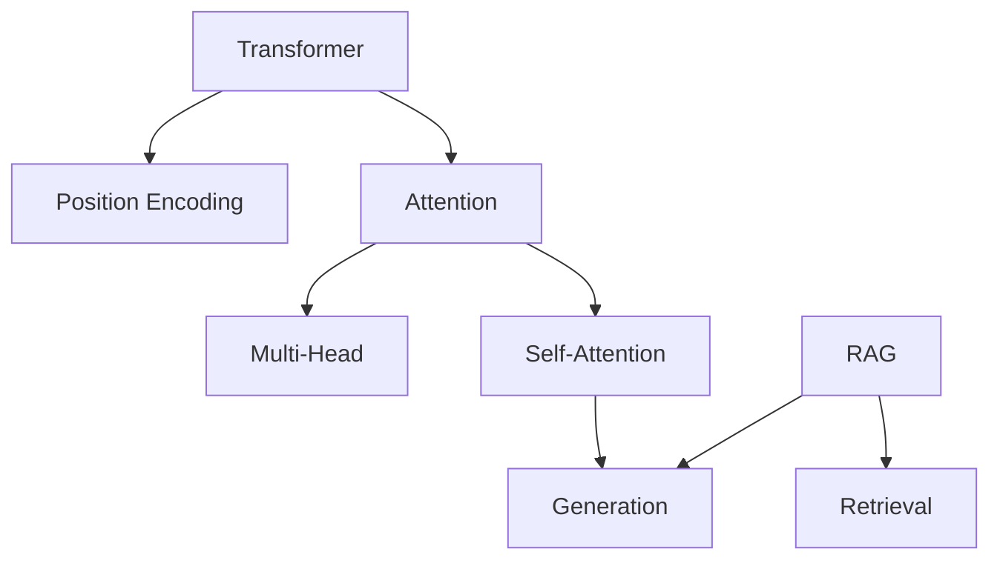

## When to Use

Use this skill when you want to:
- Deeply reflect on what you learned
- Consolidate knowledge and find blind spots
- Get personalized learning suggestions
- Discover connections between concepts
- Optimize your learning strategy

**Triggers:**
- User says "reflect on learning", "反思学习", "学习反思"
- User mentions "knowledge gaps", "知识盲点"
- User asks "what should I learn next", "接下来学什么"
- User wants "learning suggestions", "学习建议"
- User mentions "consolidate knowledge", "巩固知识"

## Quick Start

### Reflect on Today's Learning
```
反思今天的学习内容
```

### Weekly Reflection
```
生成本周学习反思报告
```

### Get Learning Suggestions
```
分析我的学习盲点并给出建议
```

### Manual Run
```bash
python {workspace}/PaperVault/scripts/learning-reflect.py
```

## Features

### 1. Deep Reflection (深度反思)
Analyzes your notes to generate insights:
- **Key concepts learned**
- **Understanding depth** (surface vs deep)
- **Connections** between papers
- **Knowledge gaps** identified
- **Questions to explore**

### 2. Knowledge Consolidation (知识巩固)
Helps you remember and understand:
- **Spaced repetition** reminders
- **Concept maps** generation
- **Analogy creation**
- **Example applications**

### 3. Blind Spot Discovery (盲点发现)
Identifies what you might have missed:
- **Incomplete understanding**
- **Related topics** not explored
- **Foundational concepts** to review
- **Contradicting viewpoints**

### 4. Learning Optimization (学习优化)
Personalized suggestions:
- **Reading priority** recommendations
- **Time allocation** suggestions
- **Learning path** optimization
- **Resource recommendations**

## Reflection Report Structure

```markdown
---
type: reflection
date: YYYY-MM-DD
period: daily|weekly|monthly
---

# 🧠 学习反思报告 - YYYY-MM-DD

## 学习概览

- **论文数量**: X 篇
- **核心概念**: X 个
- **理解深度**: ⭐⭐⭐☆☆ (3/5)

## 核心收获

### 1. 概念理解
- **Transformer 架构**: 
  - 理解了自注意力机制
  - 掌握了位置编码原理
  - 需要深入: 多头注意力的细节

### 2. 方法学习
- **RAG 优化**:
  - 学习了检索增强策略
  - 了解了重排序方法
  - 待探索: 混合检索方案

## 知识连接



## 盲点发现

### ❓ 理解不完整
1. **Layer Normalization**: 了解了作用，但不清楚与 Batch Norm 的区别
2. **Beam Search**: 听说过，但没有深入理解

### 🔍 相关但未探索
1. **Efficient Transformers**: 与标准 Transformer 的对比
2. **Vision Transformers**: 在图像领域的应用

### 📚 基础需加强
1. **概率图模型**: 是理解某些论文的基础
2. **强化学习**: Agent 论文中经常用到

## 巩固建议

### 今日复习
- [ ] 重读 Transformer 论文第 3 节
- [ ] 手推一次注意力公式
- [ ] 画出完整的架构图

### 本周任务
- [ ] 对比 3 种位置编码方法
- [ ] 实现一个简单的 RAG demo
- [ ] 阅读补充材料

## 学习建议

### 🎯 优先级调整
1. **高优先级**: 深入理解 Transformer 细节
2. **中优先级**: RAG 优化方法实践
3. **低优先级**: 扩展阅读其他架构

### ⏰ 时间分配
- **理论**: 40% (深入理解原理)
- **实践**: 40% (代码实现)
- **阅读**: 20% (扩展视野)

### 📖 推荐资源
1. **Transformer 可视化**: https://jalammar.github.io/illustrated-transformer/
2. **RAG 实战教程**: LangChain 官方文档
3. **论文**: "Attention Is All You Need" (再读一遍)

## 下一步计划

### 即时行动
1. 完成今日复习任务
2. 整理 Transformer 笔记
3. 准备 RAG 实践环境

### 本周目标
1. 完成 Transformer 深度学习
2. 实现第一个 RAG demo
3. 阅读 3 篇相关论文

### 长期规划
1. 建立 Transformer 知识体系
2. 掌握 RAG 最佳实践
3. 探索 Agent 应用场景

## 自我评估

| 维度 | 评分 | 说明 |
|------|------|------|
| 理解深度 | ⭐⭐⭐☆☆ | 基本概念清晰，细节需加强 |
| 知识连接 | ⭐⭐⭐⭐☆ | 能发现概念间联系 |
| 实践能力 | ⭐⭐☆☆☆ | 理论多，实践少 |
| 持续性 | ⭐⭐⭐⭐☆ | 坚持每日学习 |

## 反思日记

今天学习了 Transformer 和 RAG 的基础知识。虽然理解了主要概念，但感觉深度不够，特别是数学推导部分。明天需要花更多时间在公式理解上，而不是只看文字描述。

实践方面明显不足，需要找时间动手实现。计划本周完成一个简单的 RAG demo，这样能更好地理解理论。

整体来说，学习方向正确，但需要调整理论和实践的比例。
```

## Reflection Types

### 1. Quick Reflection (5 minutes)
**When**: After reading each paper
**Focus**: 
- Main takeaway (1 sentence)
- Questions (1-2)
- Next steps (1-2)

### 2. Daily Reflection (15 minutes)
**When**: End of each day
**Focus**:
- What I learned today
- What confused me
- What to review tomorrow

### 3. Weekly Reflection (30 minutes)
**When**: End of each week
**Focus**:
- Weekly themes
- Knowledge connections
- Progress towards goals

### 4. Monthly Reflection (1 hour)
**When**: End of each month
**Focus**:
- Monthly achievements
- Knowledge map evolution
- Strategy adjustment

## Prompt Templates

### Concept Understanding Check
```
基于我的笔记，请帮我反思对 "{concept}" 的理解：

1. **我理解的层次**:
   - [ ] 能复述定义
   - [ ] 能解释原理
   - [ ] 能举例说明
   - [ ] 能发现联系
   - [ ] 能批判评价

2. **可能的理解盲点**:
   - 
   - 

3. **建议深入的方向**:
   - 
   - 
```

### Knowledge Connection Discovery
```
请分析以下概念之间的联系：
{concept1}, {concept2}, {concept3}

1. **直接联系**:
2. **间接联系**:
3. **共同基础**:
4. **应用场景重叠**:
```

### Learning Strategy Optimization
```
基于我过去 {period} 的学习记录：

1. **时间分配分析**:
   - 阅读时间: X%
   - 思考时间: X%
   - 实践时间: X%

2. **效率评估**:
   - 高效时段: 
   - 低效时段: 

3. **优化建议**:
   - 
   - 
```

## Advanced Features

### Spaced Repetition
Automatically suggests concepts to review based on:
- Ebbinghaus forgetting curve
- Your understanding depth
- Concept importance

### Knowledge Graph Generation
Creates visual maps of:
- Concept relationships
- Learning paths
- Knowledge gaps

### Comparative Analysis
Compares your learning with:
- Previous periods
- Recommended paths
- Expert roadmaps

## Integration with Other Skills

- **paper-fetcher**: Source of papers to reflect on
- **paper-summarizer**: Summaries to analyze
- **pdf-reader**: Deep paper understanding
- **self-improving**: Long-term memory

## Troubleshooting

### Not Enough Data
```
Error: Insufficient notes for reflection
```
**Solution**: Use paper-fetcher to get more papers first.

### Superficial Reflection
```
Warning: Reflection too shallow
```
**Solution**: 
1. Add more detailed notes
2. Use pdf-reader for deeper analysis
3. Increase reflection time

## Best Practices

1. **Reflect Daily**: 15 minutes at end of day
2. **Be Honest**: Admit what you don't understand
3. **Take Action**: Act on the suggestions
4. **Track Progress**: Review reflections over time
5. **Stay Curious**: Follow the questions that arise

## Related Skills

- `paper-fetcher` - Paper retrieval
- `paper-summarizer` - Progress tracking
- `pdf-reader` - Deep understanding
- `self-improving` - Long-term memory
