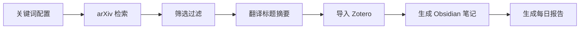

# Paper Fetcher 📥

> 从 arXiv 自动检索论文、翻译标题摘要、导入 Zotero、生成 Obsidian 笔记

[]()
[]()

## 📖 简介

Paper Fetcher 是一个自动化的论文检索工具，能够：
- 🔍 根据关键词从 arXiv 检索最新论文
- 🌐 自动翻译标题和摘要为中文
- 📚 导入到 Zotero 文献库
- 📝 生成结构化的 Obsidian 笔记

## 🎯 使用场景

- 每日自动检索最新论文
- 追踪特定研究方向的进展
- 建立个人论文知识库
- 快速了解论文内容（中文翻译）

## 🚀 快速开始

### 触发词
```
"搜索今天的论文"
"检索 arXiv 上关于 transformer 的最新论文"
"fetch papers about machine learning"
```

### 手动运行
```bash
python scripts/daily-search.py
```

## ⚙️ 配置

### 关键词配置 (`config/keywords.json`)

```json
{
  "keywords": [
    "machine learning",
    "deep learning",
    "transformer",
    "LLM",
    "agent"
  ],
  "max_papers_per_day": 15,
  "auto_import": true
}
```

### 翻译 API 配置 (`config/translate.json`)

```json
{
  "provider": "kimi",
  "api_key": "your-api-key",
  "base_url": "https://api.moonshot.cn/v1",
  "model": "moonshot-v1-8k",
  "enabled": true
}
```

## 📝 生成的笔记结构

```markdown
---
title: "English Title"
title_cn: "中文标题"
arxiv_id: "2303.12345"
authors: ["Author 1", "Author 2"]
year: 2024
doi: "10.48550/arXiv.2303.12345"
tags: [daily-search, auto-import]
status: "unread"
---

# English Title

> [!info] 文献信息
> - **作者**: Author 1; Author 2
> - **arXiv**: [2303.12345](https://arxiv.org/abs/2303.12345)
> - **中文标题**: 中文标题

## 摘要

English abstract...

## 🇨🇳 中文翻译

**标题**: 中文标题

**摘要**: 中文摘要...
```

## 🔧 高级功能

### 自定义关键词
编辑 `config/keywords.json` 添加你的研究领域关键词

### 调整每日上限
修改 `max_papers_per_day` 控制每天检索的论文数量

### 跳过翻译
设置 `enabled: false` 禁用自动翻译

## 📊 工作流程



## 🐛 故障排除

### 没有找到新论文
- 检查关键词是否匹配你的研究领域
- 检查网络连接
- 尝试更通用的关键词

### 翻译失败
- 检查 API key 是否正确
- 检查 API 配额
- 检查 `enabled` 是否为 `true`

### Zotero 导入失败
- 确保 Zotero 正在运行
- 检查 Connector 是否启用（localhost:23119）

## 📚 相关 Skills

- [Paper Summarizer](../paper-summarizer) - 生成学习报告
- [Learning Reflector](../learning-reflector) - 深度反思学习
- [PDF Reader](../pdf-reader) - 深度阅读论文

## 📄 许可证

MIT License

---

[← 返回主页](../../README.md)
