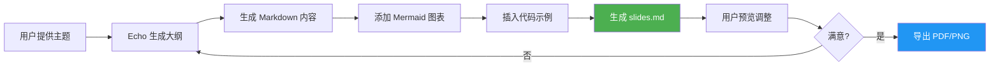

## When to Use

Use this skill when you want to:
- Generate Slidev presentation slides
- Create technical presentations with diagrams
- Convert content to Markdown slides
- Export presentations to PDF/PNG

**Triggers:**
- User says "create presentation", "生成幻灯片", "创建 Slidev"
- User mentions "Slidev", "slides", "演示文稿"
- User provides topic or outline for presentation
- User asks to "make slides", "制作幻灯片"

## Quick Start

### Create a Presentation
```
创建一个关于机器学习的 Slidev 演示文稿
```

### Create from Outline
```
根据以下大纲生成 Slidev 幻灯片：
1. 介绍
2. 核心概念
3. 应用案例
4. 总结
```

### Add Diagrams
```
生成一个包含系统架构图的 Slidev 演示
```

## Features

### 1. Automatic Content Generation
Generates structured slides:
- Title slide
- Table of contents
- Content sections
- Code examples
- Diagrams (Mermaid)
- Summary
- Q&A

### 2. Multiple Themes
Supports Slidev themes:
- Default (seriph)
- Apple-style
- Dark mode
- Custom themes

### 3. Rich Content
Includes:
- Markdown formatting
- Code blocks with syntax highlighting
- Mermaid diagrams
- Images and icons
- Tables
- Math formulas (KaTeX)

### 4. Export Options
Export to:
- PDF
- PNG images
- SPA (Single Page Application)
- Hosted presentation

## Slide Structure

### Basic Template
```markdown
---
# 主题：机器学习入门

一个关于机器学习基础概念的演示文稿

<div class="pt-12">
  <span @click="$slidev.nav.next" class="px-2 py-1 rounded cursor-pointer" hover="bg-white bg-opacity-10">
    按空格键继续 <carbon:arrow-right class="inline"/>
  </span>
</div>

---
# 目录

- 什么是机器学习？
- 机器学习的类型
- 核心算法
- 应用案例
- 未来展望

---
# 什么是机器学习？

机器学习是人工智能的一个分支...

<v-click>

## 关键特点

- 自动学习
- 数据驱动
- 持续改进

</v-click>

---
# 机器学习的类型

\`\`\`mermaid
graph TB
    A[机器学习] --> B[监督学习]
    A --> C[无监督学习]
    A --> D[强化学习]
    
    B --> B1[分类]
    B --> B2[回归]
    
    C --> C1[聚类]
    C --> C2[降维]
\`\`\`

---
# 核心算法

| 算法 | 类型 | 应用 |
|------|------|------|
| 线性回归 | 监督学习 | 预测 |
| 决策树 | 监督学习 | 分类 |
| K-means | 无监督学习 | 聚类 |
| 神经网络 | 深度学习 | 图像识别 |

---
# 代码示例

\`\`\`python {all|2|1-2|all}
from sklearn.linear_model import LinearRegression

# 创建模型
model = LinearRegression()
model.fit(X_train, y_train)

# 预测
predictions = model.predict(X_test)
\`\`\`

---
# 应用案例

<v-clicks>

- 🖼️ **图像识别** - 人脸识别、物体检测
- 🗣️ **语音识别** - 语音助手、转写
- 📝 **自然语言处理** - 翻译、情感分析
- 🚗 **自动驾驶** - 特斯拉、Waymo
- 🏥 **医疗诊断** - 疾病预测、影像分析

</v-clicks>

---
# 未来展望

<div class="grid grid-cols-2 gap-4">
<div>

## 挑战

- 数据隐私
- 模型可解释性
- 计算资源

</div>
<div>

## 机遇

- 更智能的 AI
- 更广泛的应用
- 更低的门槛

</div>
</div>

---
# 总结

机器学习正在改变世界...

<div class="mt-12">
  感谢聆听！
</div>

---
# Q&A

有问题吗？

<div class="text-center mt-8">
  联系方式：your@email.com
</div>
```

## Advanced Features

### 1. Animations
```markdown
---
# 动画效果

<v-click>

这段文字会在点击后出现

</v-click>

<v-clicks>

- 项目 1
- 项目 2
- 项目 3

</v-clicks>
\`\`\`
```

### 2. Code Highlighting
```markdown
---
# 代码高亮

\`\`\`python {1-2|3-4|all}
# 这段会被高亮
import numpy as np

# 这段也会被高亮
import pandas as pd
\`\`\`
\`\`\`
```

### 3. Two Columns
```markdown
---
# 双栏布局

<div class="grid grid-cols-2 gap-4">
<div>

## 左侧内容

- 要点 1
- 要点 2

</div>
<div>

## 右侧内容

- 要点 3
- 要点 4

</div>
</div>
\`\`\`
```

### 4. Math Formulas
```markdown
---
# 数学公式

行内公式：$E = mc^2$

独立公式：

$$
\frac{\partial f}{\partial x} = \lim_{h \to 0} \frac{f(x+h) - f(x)}{h}
$$
\`\`\`
```

## Workflow



## Installation & Setup

### Install Slidev
```bash
npm install -g @slidev/cli
```

### Create Project
```bash
mkdir my-presentation
cd my-presentation
slidev init
```

### Install Mermaid Plugin
```bash
npm install @slidev/plugin-mermaid
```

### Configure (slidev.config.js)
```javascript
import { defineConfig } from 'slidev'
import mermaid from '@slidev/plugin-mermaid'

export default defineConfig({
  plugins: [
    mermaid()
  ],
  theme: 'seriph',
  highlighter: 'shiki'
})
```

## Commands

### Preview
```bash
slidev slides.md --open
```

### Export PDF
```bash
slidev export slides.md --format pdf
```

### Export PNG
```bash
slidev export slides.md --format png
```

### Export SPA
```bash
slidev build slides.md
```

## Themes

### Built-in Themes
- `seriph` (default)
- `apple-basic`
- `shibainu`
- `dracula`

### Custom Theme
```bash
npm install slidev-theme-your-theme
```

Then in `slides.md`:
```markdown
---
theme: your-theme
---
```

## Export Formats

| Format | Command | Use Case |
|--------|---------|----------|
| PDF | `slidev export --format pdf` | Print, share |
| PNG | `slidev export --format png` | Images |
| SPA | `slidev build` | Web hosting |
| MP4 | `slidev export --format mp4` | Video |

## Best Practices

1. **Keep Slides Simple**: One concept per slide
2. **Use Visuals**: Diagrams, charts, images
3. **Animate Key Points**: Use v-click for emphasis
4. **Code Examples**: Highlight important lines
5. **Consistent Style**: Use same fonts and colors
6. **Practice Timing**: Aim for 1-2 minutes per slide

## Example Prompts

### Technical Presentation
```
创建一个关于微服务架构的 Slidev 演示，包含：
- 什么是微服务
- 与单体架构对比
- 核心组件
- 部署策略
- 最佳实践
```

### Tutorial
```
生成一个 Python 入门教程的 Slidev 幻灯片，适合初学者
```

### Research Report
```
创建一个关于深度学习最新进展的研究报告 Slidev 演示
```

### Product Demo
```
生成一个产品功能演示的 Slidev 幻灯片
```

## Troubleshooting

### Mermaid Not Rendering
**Problem**: Mermaid diagrams show as code
**Solution**: Install `@slidev/plugin-mermaid`

### Export Fails
**Problem**: PDF export fails
**Solution**: 
```bash
npm install playwright
npx playwright install
```

### Slow Preview
**Problem**: Preview is slow
**Solution**: Reduce image sizes, use simpler diagrams

## Related Skills

- `diagram-generator` - Generate Mermaid diagrams
- `code-documenter` - Document code with examples
- `content-writer` - Generate presentation content

## Future Enhancements

- [ ] Auto-generate from markdown files
- [ ] Integration with Git for version control
- [ ] Team collaboration features
- [ ] AI-powered design suggestions
- [ ] Multi-language support

## Resources

- **Slidev Docs**: https://sli.dev/
- **Gallery**: https://sli.dev/showcases/
- **Themes**: https://sli.dev/themes/gallery
- **Mermaid**: https://mermaid.js.org/
