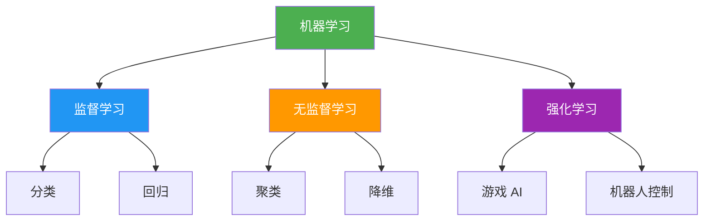
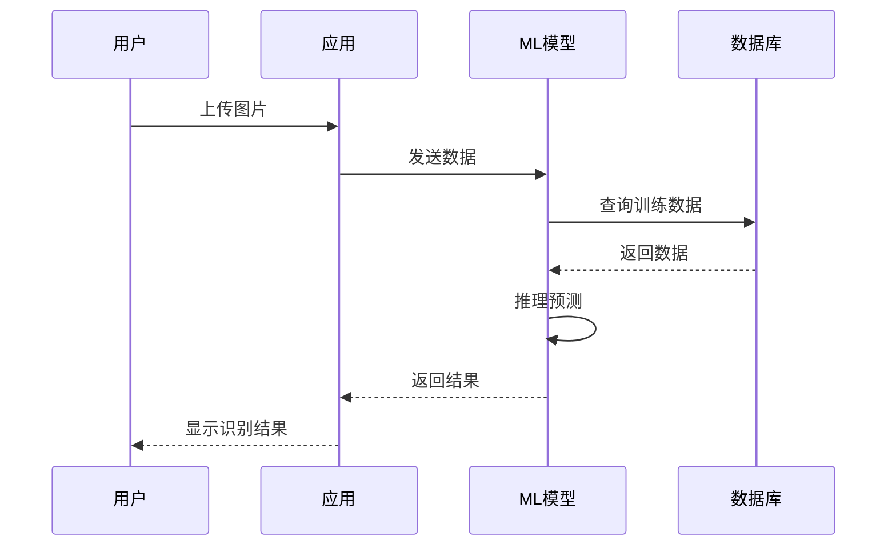
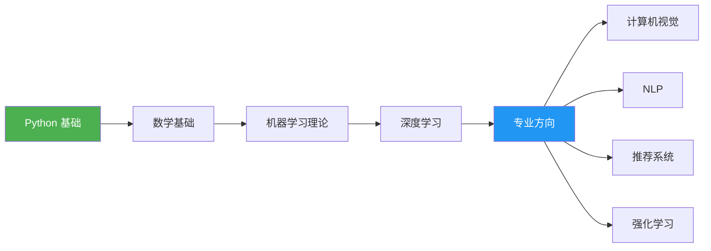

---
# 主题：机器学习入门

一个关于机器学习基础概念的演示文稿

<div class="pt-12">
  <span @click="$slidev.nav.next" class="px-2 py-1 rounded cursor-pointer" hover="bg-white bg-opacity-10">
    按空格键继续 <carbon:arrow-right class="inline"/>
  </span>
</div>

---

# 目录

- 什么是机器学习？
- 机器学习的类型
- 核心算法
- 应用案例
- 未来展望

---

# 什么是机器学习？

<v-click>

**机器学习**是人工智能的一个分支，让计算机能够从数据中学习并做出决策或预测。

</v-click>

<v-click>

## 关键特点

- 🤖 **自动学习** - 无需显式编程
- 📊 **数据驱动** - 基于数据做出决策
- 🔄 **持续改进** - 随着更多数据不断优化

</v-click>

---

# 机器学习的类型



---

# 核心算法

| 算法 | 类型 | 应用场景 | 复杂度 |
|------|------|----------|--------|
| 线性回归 | 监督学习 | 价格预测 | ⭐ |
| 决策树 | 监督学习 | 分类决策 | ⭐⭐ |
| K-means | 无监督学习 | 客户分群 | ⭐⭐ |
| 神经网络 | 深度学习 | 图像识别 | ⭐⭐⭐⭐ |
| Transformer | 深度学习 | NLP/GPT | ⭐⭐⭐⭐⭐ |

---

# 代码示例：线性回归

```python {all|2|1-2|all}
from sklearn.linear_model import LinearRegression
import numpy as np

# 创建训练数据
X_train = np.array([[1], [2], [3], [4], [5]])
y_train = np.array([2, 4, 6, 8, 10])

# 创建并训练模型
model = LinearRegression()
model.fit(X_train, y_train)

# 预测
X_test = np.array([[6], [7]])
predictions = model.predict(X_test)
print(predictions)  # [12. 14.]
```

<v-click>

💡 **关键步骤**：数据准备 → 模型训练 → 预测

</v-click>

---

# 应用案例

<v-clicks>

- 🖼️ **图像识别**
  - 人脸识别、物体检测、医学影像

- 🗣️ **语音识别**
  - Siri、小爱同学、语音转写

- 📝 **自然语言处理**
  - 机器翻译、情感分析、ChatGPT

- 🚗 **自动驾驶**
  - 特斯拉、Waymo、蔚来

- 🏥 **医疗诊断**
  - 疾病预测、基因分析、药物研发

- 📈 **金融风控**
  - 信用评分、欺诈检测、量化交易

</v-clicks>

---

# 应用流程



---

# 未来展望

<div class="grid grid-cols-2 gap-8">
<div>

## 🎯 挑战

<v-clicks>

- **数据隐私** - 如何保护用户数据？
- **模型可解释性** - 为什么做出这个决策？
- **计算资源** - 高昂的训练成本
- **偏见问题** - 数据中的偏见传递

</v-clicks>

</div>
<div>

## 🌟 机遇

<v-clicks>

- **更智能的 AI** - 通用人工智能 (AGI)
- **更广泛的应用** - 渗透到各行各业
- **更低的门槛** - AutoML、低代码平台
- **更强的性能** - 量子计算 + AI

</v-clicks>

</div>
</div>

---

# 学习路径



---

# 推荐资源

<div class="grid grid-cols-2 gap-4">
<div>

## 📚 在线课程

- [Coursera - Machine Learning](https://www.coursera.org/learn/machine-learning)
- [Fast.ai](https://www.fast.ai/)
- [吴恩达深度学习](https://www.deeplearning.ai/)

</div>
<div>

## 📖 经典书籍

- 《机器学习》- 周志华
- 《深度学习》- Goodfellow
- 《统计学习方法》- 李航

</div>
</div>

---

# 总结

<v-clicks>

✅ **机器学习**是让计算机从数据中学习的技术

✅ **三大类型**：监督学习、无监督学习、强化学习

✅ **广泛应用**：图像、语音、NLP、自动驾驶、医疗等

✅ **未来趋势**：更智能、更普及、更高效

</v-clicks>

<div class="mt-12 text-center text-xl">
  机器学习正在改变世界，而我们也正在改变机器学习。
</div>

---

# Q&A

<div class="text-center mt-8">
  
  <div class="text-6xl mb-8">❓</div>
  
  <div class="text-2xl mb-4">有问题吗？</div>
  
  <div class="text-gray-500">
    欢迎提问和讨论
  </div>
  
</div>

<div class="absolute bottom-8 left-1/2 transform -translate-x-1/2">
  <div class="text-sm text-gray-400">
    联系方式：your@email.com | GitHub: @yourusername
  </div>
</div>

---
